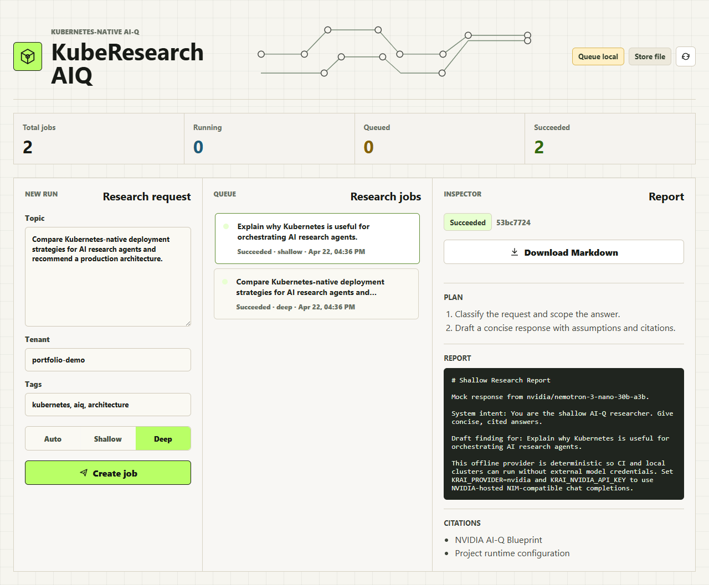
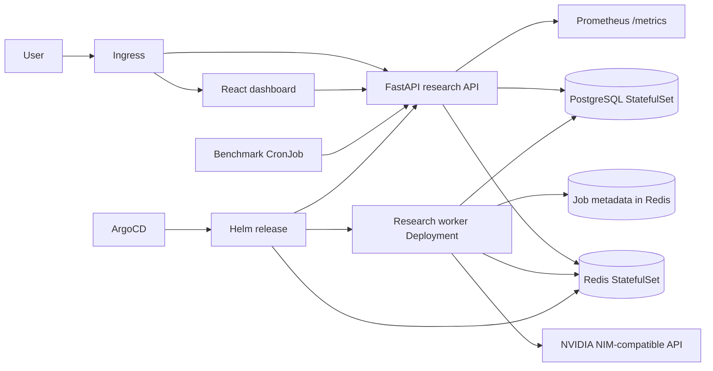

# KubeResearch AIQ

[](https://github.com/agrovr/kube-research-aiq/actions/workflows/ci.yml)
[](apps/research-service)
[](apps/dashboard)
[](charts/kube-research-aiq)
[](https://build.nvidia.com/nvidia/aiq/blueprintcard)

KubeResearch AIQ is a Kubernetes-native research-agent platform inspired by the
NVIDIA AI-Q Blueprint. It turns the AI-Q idea of shallow and deep research agents
into an async, production-shaped service with an API, worker pool, Helm chart,
GitOps example, metrics, autoscaling, and benchmark job hooks.

The service runs without external credentials in `mock` mode, which makes CI and
local demos reliable. For real model calls, set `KRAI_PROVIDER=nvidia` and provide
`KRAI_NVIDIA_API_KEY`.



## Why this is Impact-worthy

- Kubernetes is the main orchestration platform, not an afterthought.
- The research workflow is split into API and worker workloads.
- Redis backs async queueing and PostgreSQL stores research jobs/reports.
- Helm includes Deployments, StatefulSets, ConfigMap, Secret, HPA, NetworkPolicy,
  ServiceMonitor, Ingress, and a benchmark CronJob.
- CI validates Python tests, linting, image builds, and Helm rendering.
- ArgoCD configuration shows how the platform would be promoted with GitOps.

## Architecture



## Repository layout

```text
apps/research-service/       FastAPI app, worker, tests, Dockerfile
apps/dashboard/              React dashboard for creating and inspecting runs
charts/kube-research-aiq/    Helm chart for Kubernetes deployment
deploy/argocd/               ArgoCD Application example
docs/                        Architecture and implementation notes
scripts/                     Local smoke-test helpers
.github/workflows/           CI pipeline
```

## Demo and deployment guides

- [Demo walkthrough](docs/demo-walkthrough.md): interview and portfolio demo flow
- [kind demo](docs/kind-demo.md): local Kubernetes demo on Docker Desktop
- [Google Cloud e2-micro k3s deployment](docs/deploy-gce-free-k3s.md): tiny free-tier public demo
- [Free k3s deployment](docs/deploy-free-k3s.md): no-cost public URL track
- [DigitalOcean Kubernetes deployment](docs/deploy-doks.md): paid managed-cluster alternative
- [Deployment options](docs/deployment-options.md): local vs public deployment tradeoffs

## Local quick start

```bash
cd apps/research-service
python -m pip install -e ".[dev]"
KRAI_PROVIDER=mock uvicorn kube_research_aiq.main:app --reload
```

Create a research job:

```bash
curl -X POST http://localhost:8000/v1/research \
  -H "Content-Type: application/json" \
  -d '{"query":"Compare Kubernetes deployment strategies for AI research agents.","depth":"deep"}'
```

Run with Redis, API, and worker:

```bash
docker compose up --build
```

Open the dashboard at `http://localhost:5173`.

For frontend-only development:

```bash
cd apps/dashboard
npm install
npm run dev
```

## Kubernetes quick start

For a laptop-friendly Kubernetes demo, use the [kind demo guide](docs/kind-demo.md).
Port-forwarded URLs from kind are local to your machine. To make the dashboard
available to other people, deploy to a reachable Kubernetes cluster with an
Ingress controller. See [deployment options](docs/deployment-options.md).

Render the chart:

```bash
helm template kuberesearch charts/kube-research-aiq --namespace aiq-system
```

Install in a cluster:

```bash
helm upgrade --install kuberesearch charts/kube-research-aiq \
  --namespace aiq-system \
  --create-namespace \
  --set image.repository=ghcr.io/agrovr/kube-research-aiq/research-service \
  --set image.tag=0.1.0
```

Use NVIDIA-hosted NIM-compatible endpoints:

```bash
helm upgrade --install kuberesearch charts/kube-research-aiq \
  --namespace aiq-system \
  --create-namespace \
  --set config.provider=nvidia \
  --set secrets.nvidiaApiKey="$NVIDIA_API_KEY"
```

## API surface

- `POST /v1/research`: create a shallow, deep, or auto-routed research job
- `GET /v1/research`: list jobs
- `GET /v1/research/{job_id}`: fetch a job and report
- `GET /v1/research/{job_id}/report.md`: download a Markdown report
- `POST /v1/research/{job_id}/run`: manually run a job, useful without Redis
- `GET /healthz`, `GET /readyz`, `GET /metrics`: operational endpoints

## Dashboard

The React dashboard provides an operator workspace with:

- Research request composer
- Auto/shallow/deep depth selection
- Queue and status view
- Report inspector with plan, citations, and output
- Markdown report download
- Runtime readiness strip for queue/store state

## Observability

The API exposes Prometheus metrics at `/metrics`, including queue availability,
created-job counts, and job totals by status/depth. The Helm chart can also
render a Grafana dashboard ConfigMap for clusters that use the Grafana dashboard
sidecar.

## NVIDIA key validation

Do not commit NVIDIA keys to this repo. To validate a key locally, set it only in
your current shell and run the validation script:

```powershell
$env:KRAI_NVIDIA_API_KEY = "paste-key-here"
.\scripts\validate-nvidia-key.ps1
```

If the key is accepted, the script prints a short list of available model IDs.
To verify chat completions too:

```powershell
.\scripts\validate-nvidia-key.ps1 -Chat -ChatModel "mistralai/mixtral-8x7b-instruct-v0.1"
```

For kind deployment with NVIDIA provider mode, see [docs/kind-demo.md](docs/kind-demo.md).

## Production deployment

The chart includes a production values file for a public Kubernetes target:

```bash
helm upgrade --install kuberesearch charts/kube-research-aiq \
  --namespace aiq-system \
  --create-namespace \
  --values charts/kube-research-aiq/values.yaml \
  --values charts/kube-research-aiq/values-production.yaml
```

The production profile expects externally managed Redis/PostgreSQL connection
strings and the NVIDIA key in a Kubernetes Secret named `krai-runtime-secrets`.
It enables Ingress, TLS annotations, HPA, NetworkPolicy, ServiceMonitor, Grafana
dashboard discovery, and benchmark CronJobs.

For GitOps, use
[`deploy/argocd/application-production.yaml`](deploy/argocd/application-production.yaml).
For live access options, see [docs/deployment-options.md](docs/deployment-options.md).

## Resume line

Built KubeResearch AIQ, a Kubernetes-native deep research agent platform with
async AI workflows, Helm deployment, GitOps, observability, and benchmark-driven
evaluation.

## Upstream inspiration

- NVIDIA AI-Q Blueprint: https://build.nvidia.com/nvidia/aiq/blueprintcard
- NVIDIA AI-Q GitHub: https://github.com/NVIDIA-AI-Blueprints/aiq
