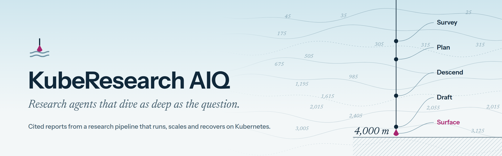
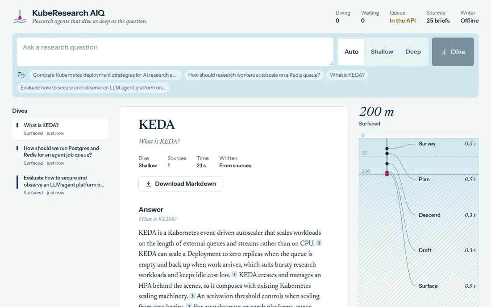
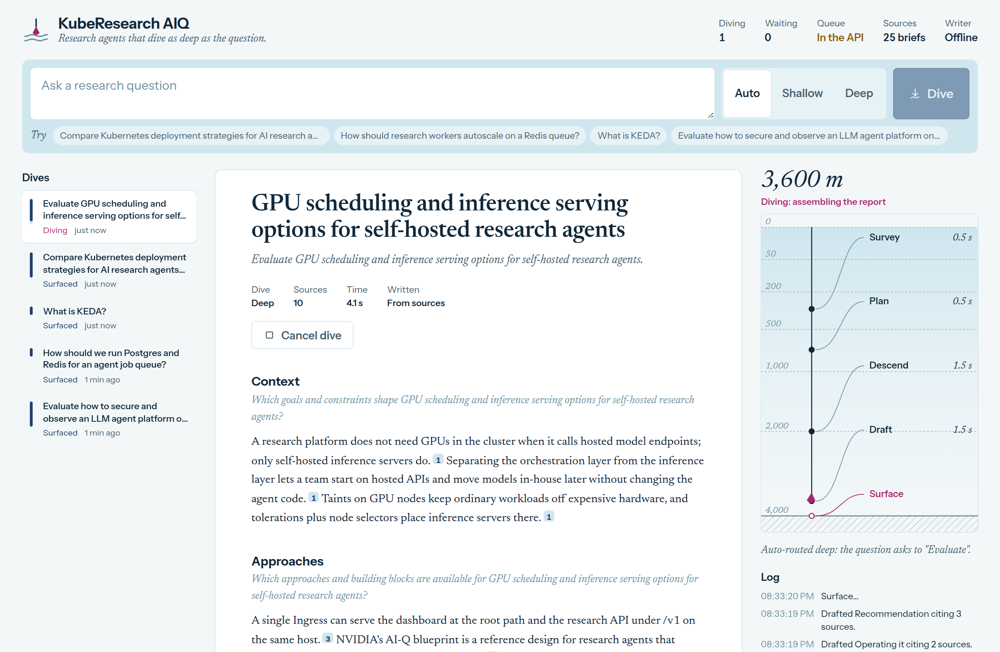
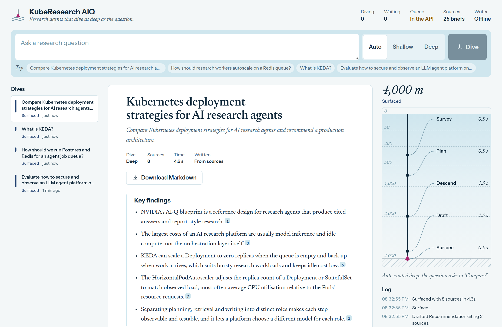
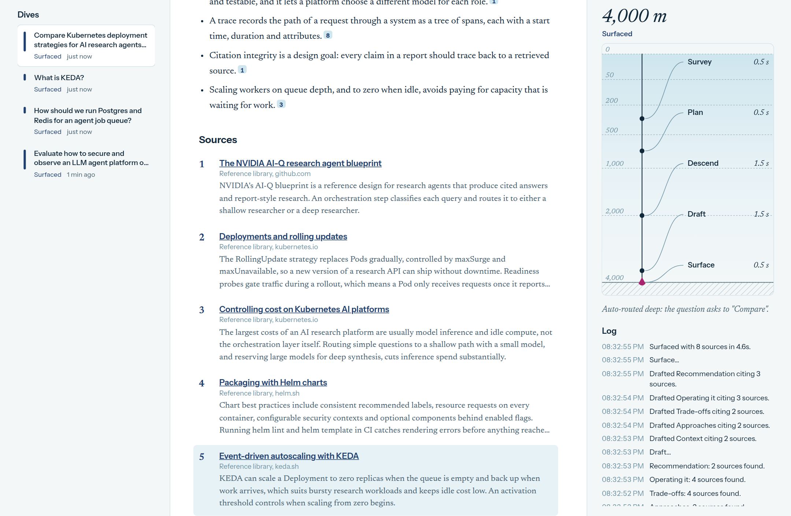
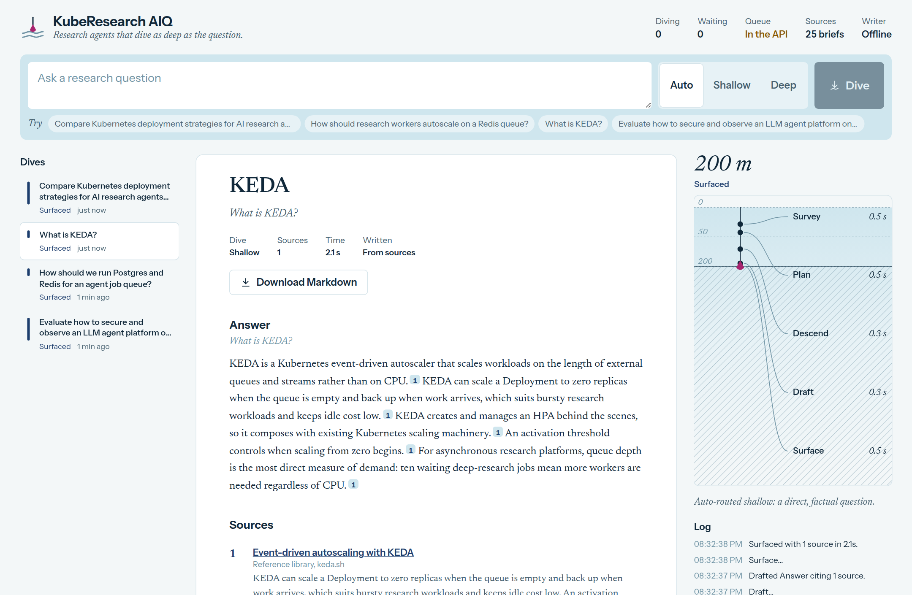
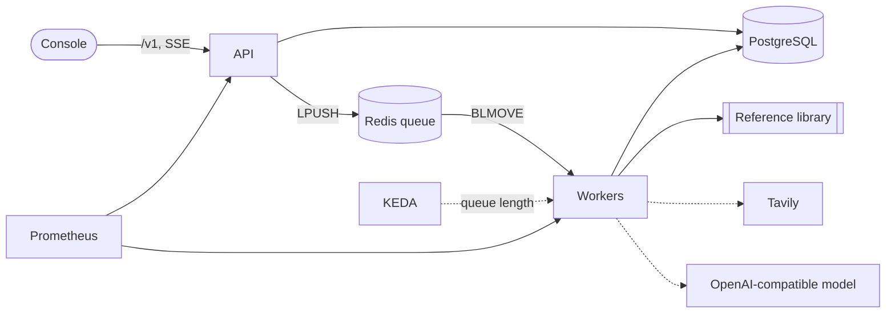

<p align="center">
  <a href="https://github.com/agrovr/kube-research-aiq/actions/workflows/ci.yml"></a>
</p>

<p align="center"><code>PYTHON 3.12</code> · <code>FASTAPI</code> · <code>REACT 19</code> · <code>REDIS</code> · <code>POSTGRESQL</code> · <code>HELM</code> · <code>ARGO CD</code> · <code>KEDA</code></p>

KubeResearch AIQ runs research agents on Kubernetes. Ask a question and it decides how deep to
go: a **shallow dive** returns one cited answer, and a **deep dive** plans the question, gathers
sources for each part and writes a full report in which every claim cites its source. The API,
the workers, the queue and the store are separate workloads that scale and recover on their own.
They are packaged with Helm and delivered with Argo CD. The design follows NVIDIA's
[AI-Q research agent blueprint](https://github.com/NVIDIA-AI-Blueprints/aiq).

It runs with no keys at all. Offline, reports are assembled from a bundled reference library and
every sentence is taken from the source it cites. Add a model endpoint and a Tavily key and the
same pipeline writes with a model and searches the web.

<p align="center"></p>

## What it does

- **Routes by depth.** Each question is read and sent shallow or deep, and the reason is recorded
  ("the question asks to compare").
- **Researches in stages.** Survey, plan, descend, draft and surface. Each stage logs its time and
  progress as it goes.
- **Cites everything.** Sources are numbered once per document. Every section cites them inline,
  and a citation can only point at a source that was actually retrieved.
- **Searches two ways.** It ranks a bundled library of 25 Kubernetes and AI-platform briefs with
  BM25, which needs no embeddings or GPUs, and adds Tavily web search when a key is set.
- **Writes with or without a model.** Offline, the writer selects cited sentences and never
  invents text. With a key, it uses any OpenAI-compatible model: NVIDIA NIM, vLLM or a hosted
  endpoint.
- **Streams live.** Progress arrives over server-sent events. Dives can be cancelled mid-run and
  retried.
- **Doesn't lose work.** Workers take jobs with `BLMOVE`. A worker that dies mid-dive is detected
  by its heartbeat and its job goes back to the front of the queue. On SIGTERM, workers finish the
  dive in hand.
- **Operates like production.** It has Prometheus metrics for dive and stage durations, a Grafana
  dashboard, KEDA scaling on queue length, NetworkPolicies, non-root read-only containers and
  GitOps delivery.

## The console

<table>
  <tr>
    <td width="50%"><br><sub><b>Diving</b>: each stage marked on the sounding line, with its time</sub></td>
    <td width="50%"><br><sub><b>Surfaced</b>: key findings, sections and a Markdown download</sub></td>
  </tr>
  <tr>
    <td width="50%"><br><sub><b>Citations</b>: every chip jumps to its source and passage</sub></td>
    <td width="50%"><br><sub><b>Shallow</b>: direct questions stop at 200 m</sub></td>
  </tr>
</table>

The console is styled like a nautical chart. Shallow water is tinted and deep water left white,
soundings are set in italic, and chart magenta marks whatever is live. On a phone, the live dive
comes first ([screenshot](docs/media/mobile.png)).

## Quick start

**Offline, no services.** This needs Python 3.11+ and Node 20+.

```bash
make install dashboard-install
make run-api          # API on :8000; dives run in the API process
make dashboard-dev    # console on :5173
```

**The whole platform**, with Redis, PostgreSQL, a separate worker and the console on
[localhost:5173](http://localhost:5173):

```bash
docker compose up --build
```

**Kubernetes.** Run it locally with [kind](docs/deploy/kind.md), or install the chart anywhere:

```bash
helm upgrade --install kuberesearch charts/kube-research-aiq -n aiq-system --create-namespace
```

**Models and web search** are optional. Set them in `.env` for compose, or in chart values:

```bash
KRAI_PROVIDER=nvidia
KRAI_NVIDIA_API_KEY=...          # or KRAI_LLM_BASE_URL for your own vLLM or NIM server
KRAI_TAVILY_API_KEY=...
```

Try a dive from the command line:

```bash
curl -X POST localhost:8000/v1/research -H 'Content-Type: application/json' \
  -d '{"query": "How should research workers autoscale on a Redis queue?"}'
./scripts/smoke-test.sh      # runs a deep dive end to end and checks its citations
```

## How a dive works

| Stage | What happens |
| :-- | :-- |
| **Survey** | Read the question, choose shallow or deep, and record why |
| **Plan** | Break it into sections, each with its own question (one for shallow, up to five for deep) |
| **Descend** | Retrieve sources for every question, favouring documents not yet used, and number each new one |
| **Draft** | Write each section from its numbered sources, citing them inline |
| **Surface** | Write the key findings, measure citation coverage and assemble the Markdown report |

Every stage saves its progress, which is also the worker's heartbeat. Between stages the worker
checks for cancellation. More in [the research engine](docs/research-engine.md).

## Architecture


```mermaid
flowchart LR
  console([Console]) -->|/v1, SSE| api[API]
  api -->|LPUSH| redis[(Redis queue)]
  api --> pg[(PostgreSQL)]
  redis -->|BLMOVE| worker[Workers]
  worker --> pg
  worker --> library[[Reference library]]
  worker -.-> tavily[Tavily]
  worker -.-> model[OpenAI-compatible model]
  keda[KEDA] -.->|queue length| worker
  prom[Prometheus] --> api & worker
```

The chart renders:

- Deployments for the API, workers and console
- StatefulSets for Redis and PostgreSQL
- HPAs or a KEDA `ScaledObject`
- NetworkPolicy
- Ingress tuned for streaming
- a ServiceMonitor covering both the API and the workers
- a Grafana dashboard
- a scheduled benchmark dive

Containers run as non-root with read-only filesystems. Credentials come from Secrets, which can be
created by the chart or referenced by name. See [architecture](docs/architecture.md) and
[operations](docs/operations.md).

## API

| | |
| :-- | :-- |
| `POST /v1/research` | Start a dive (`query`, `depth`: `auto`, `shallow` or `deep`) |
| `GET /v1/research/{id}` | The dive: plan, sections, sources, timeline, report |
| `GET /v1/research/{id}/events` | Live updates as server-sent events |
| `GET /v1/research/{id}/report.md` | The report as Markdown |
| `POST /v1/research/{id}/cancel`, `/retry` | Stop a dive, or send it down again |
| `GET /v1/meta`, `/v1/library` | Writer, sources, queue and store; the reference library |

There are also `GET /v1/research`, `POST /v1/research/{id}/run`, `/healthz`, `/readyz`,
`/metrics`, and interactive docs at `/docs`. Full reference: [docs/api.md](docs/api.md).

## Repository layout

```text
apps/research-service/      FastAPI API, worker, research pipeline, reference library, tests
  src/kube_research_aiq/
    researcher.py           the five-stage pipeline and depth routing
    retrieval.py            BM25 over the library, Tavily web search, merging
    writer.py               offline and model writers, planning, citations
    queue.py                reliable Redis queue and stalled-job reaper
    library/                25 reference briefs, one Markdown file each
apps/dashboard/             the console (React, TypeScript, Vite)
charts/kube-research-aiq/   Helm chart with kind, free-tier and production profiles
deploy/argocd/              Argo CD applications
docs/                       architecture, engine, API, operations, deployment guides
scripts/                    smoke tests, kind and cloud deployment, media capture
```

## Development

```bash
make test        # pytest: retrieval, writers, pipeline, cancellation, API, streaming, queue
make lint        # ruff
cd apps/dashboard && npm run lint && npm run build
```

CI runs on every push and pull request:

- lint and the full test suite
- an end-to-end dive through the running API
- the console's lint and type-checked build
- `helm lint` and `helm template` for every values profile and for KEDA, validated with
  kubeconform
- both container images, with a smoke test of the API image

On `main`, CI also publishes the images to GHCR.

## Documentation

[Architecture](docs/architecture.md) · [Research engine](docs/research-engine.md) ·
[API](docs/api.md) · [Operating it](docs/operations.md) · [Deployment](docs/deploy/README.md) ·
[Demo walkthrough](docs/demo-walkthrough.md) · [Roadmap](docs/roadmap.md)
