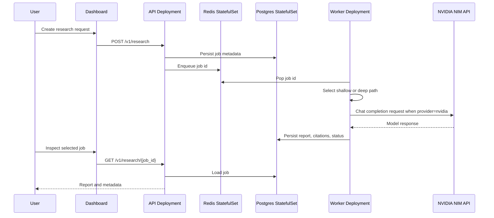

# Architecture

KubeResearch AIQ adapts NVIDIA AI-Q's orchestration, shallow research, and deep
research workflow into a Kubernetes-first system.

## Kubernetes resources

| Resource | Purpose |
| --- | --- |
| Namespace `aiq-system` | Isolates the platform runtime |
| Deployment `api` | FastAPI control plane for research job creation and status |
| Deployment `worker` | Async research execution pool |
| Deployment `dashboard` | React operator UI served by nginx |
| StatefulSet `redis` | Queue and job metadata store |
| StatefulSet `postgres` | Durable research job metadata and report storage |
| ConfigMap | AI-Q style workflow routing and model configuration |
| Secret | NVIDIA, Tavily, and Serper API keys |
| HPA | Scales API and worker pods based on CPU |
| NetworkPolicy | Limits inbound and outbound pod traffic |
| ServiceMonitor | Optional Prometheus Operator integration |
| CronJob | Optional recurring benchmark/research evaluation trigger |
| ArgoCD Application | GitOps deployment definition |

## Request flow

## AI-Q mapping

| AI-Q concept | KubeResearch AIQ implementation |
| --- | --- |
| Orchestration node | Depth selection in `ResearchRunner._select_depth` |
| Shallow researcher | Fast, bounded report path |
| Deep researcher | Plan plus synthesis report path |
| YAML workflow config | Helm ConfigMap mounted as `/etc/krai/workflow.yaml` |
| Async deep jobs | Redis queue plus worker Deployment |
| Evaluation harness | Benchmark CronJob hook and CI-ready mock provider |
| Deployment assets | Helm chart and ArgoCD Application |
| Web UI | React dashboard for creating and reviewing jobs |

## Production hardening ideas

- Add backup and restore runbooks for PostgreSQL.
- Add OpenTelemetry traces for each research step.
- Add per-tenant rate limits and Kubernetes ResourceQuotas.
- Add dashboard charts for latency, report volume, and evaluation scores.
- Add a custom `ResearchRun` CRD and controller for native Kubernetes job objects.
