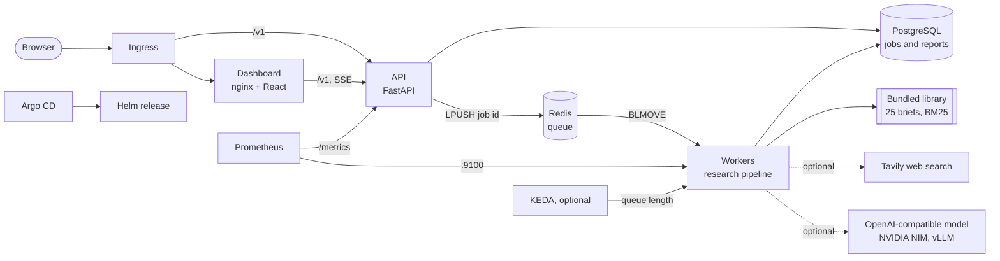
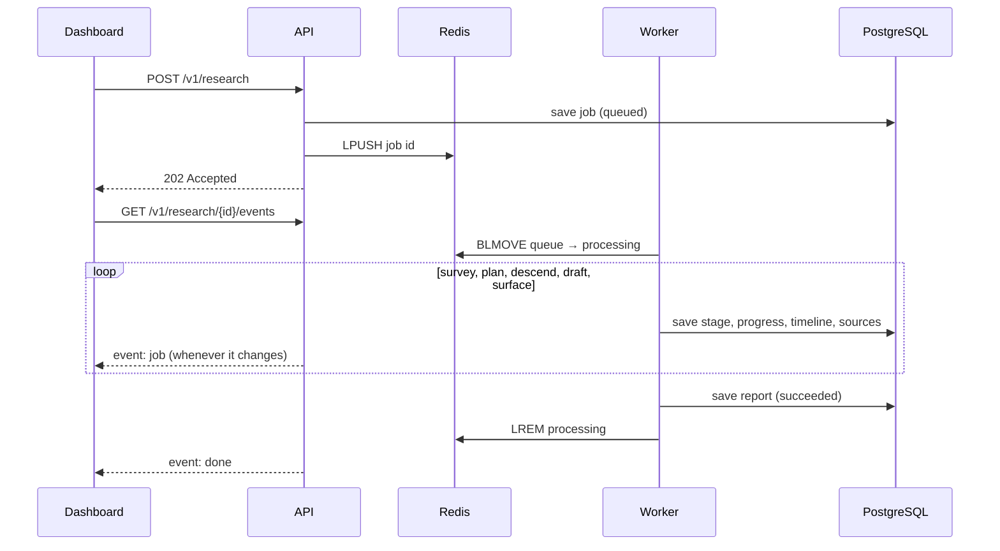

# Architecture

KubeResearch AIQ splits research into workloads that Kubernetes can scale and heal on their
own: an API that accepts dives and streams their progress, a pool of workers that run them,
a queue between the two, and a durable store for every job, report and timeline.

```mermaid
flowchart LR
  user([Browser]) --> ingress[Ingress]
  ingress --> dashboard[Dashboard<br/>nginx + React]
  ingress -->|/v1| api[API<br/>FastAPI]
  dashboard -->|/v1, SSE| api
  api -->|LPUSH job id| redis[(Redis<br/>queue)]
  api --> pg[(PostgreSQL<br/>jobs and reports)]
  redis -->|BLMOVE| worker[Workers<br/>research pipeline]
  worker --> pg
  worker --> library[[Bundled library<br/>25 briefs, BM25]]
  worker -.->|optional| tavily[Tavily web search]
  worker -.->|optional| llm[OpenAI-compatible model<br/>NVIDIA NIM, vLLM]
  prom[Prometheus] -->|/metrics| api
  prom -->|:9100| worker
  keda[KEDA, optional] -->|queue length| worker
  argocd[Argo CD] --> helm[Helm release]
```

## Workloads

| Resource | Role |
| :-- | :-- |
| Deployment `api` | Accepts dives, serves jobs and reports, streams progress over server-sent events, reports queue metrics |
| Deployment `worker` | Takes jobs from the queue and runs the [research pipeline](research-engine.md); returns stalled jobs to the queue |
| Deployment `dashboard` | The static console, served by nginx, which proxies `/v1` to the API with buffering off for the event stream |
| StatefulSet `redis` | The job queue (in-cluster for demos; managed in production) |
| StatefulSet `postgres` | Jobs, reports, sources and timelines as `jsonb`, with indexed status, tenant and time columns |
| HPA or KEDA `ScaledObject` | Scales the API on CPU and the workers on CPU, or on queue length with KEDA |
| Service `worker-metrics` | Headless Service so Prometheus can scrape each worker's dive and stage histograms |
| NetworkPolicy | Default-deny between pods except API, dashboard, Redis, PostgreSQL, DNS and HTTPS egress |
| ServiceMonitor, Grafana ConfigMap | Optional Prometheus Operator scraping and a ready-made dashboard |
| CronJob `benchmark` | Sends a fixed deep dive on a schedule, so regressions show up in the metrics |
| Argo CD `Application` | GitOps sync of the chart with the production values |

## A dive, end to end

```mermaid
sequenceDiagram
  participant D as Dashboard
  participant A as API
  participant R as Redis
  participant W as Worker
  participant P as PostgreSQL

  D->>A: POST /v1/research
  A->>P: save job (queued)
  A->>R: LPUSH job id
  A-->>D: 202 Accepted
  D->>A: GET /v1/research/{id}/events
  W->>R: BLMOVE queue → processing
  loop survey, plan, descend, draft, surface
    W->>P: save stage, progress, timeline, sources
    A-->>D: event: job (whenever it changes)
  end
  W->>P: save report (succeeded)
  W->>R: LREM processing
  A-->>D: event: done
```

## Reliability

- **No lost jobs.** Workers move a job id into a processing list with `BLMOVE`, and remove it only
  after the job is saved as finished. A worker that crashes leaves the id behind.
- **Stalled jobs come back.** Every save refreshes the job's heartbeat. Every 30 seconds each
  worker looks for processing jobs whose heartbeat is older than `staleAfterSeconds` and returns
  them to the front of the queue, guarded by a Redis lock so only one worker acts. After
  `maxAttempts` the job is marked failed with the reason.
- **Graceful rollouts.** On SIGTERM a worker finishes the dive in hand before exiting, within
  `terminationGracePeriodSeconds` (90 by default).
- **Idempotent saves.** Saving a job is an upsert, so a job delivered twice overwrites itself.
- **Cancellation.** The API marks a job cancelled; the worker checks before every save and stops
  at the next checkpoint without overwriting the cancellation.
- **Degrades instead of failing.** Without Redis the API runs dives as background tasks; without
  PostgreSQL or Redis it stores jobs in a JSON file; if web search fails the dive continues on the
  library and logs a warning.

## Mapping to NVIDIA AI-Q

| AI-Q concept | Here |
| :-- | :-- |
| Orchestration node that routes by depth | `choose_depth` in [`researcher.py`](../apps/research-service/src/kube_research_aiq/researcher.py), with the reason recorded on the job |
| Shallow researcher | One question, more sources, a single cited answer |
| Deep researcher: plan, research, write | Plan → descend (retrieve per question) → draft each section → surface with key findings |
| Knowledge layers (web search, enterprise RAG) | Bundled BM25 library plus optional Tavily, merged and de-duplicated |
| Citation integrity | One number per source document; citations that point nowhere are dropped |
| Async job API | `POST /v1/research`, event stream, cancel and retry |

## Security defaults

Containers run as non-root with a read-only root filesystem, no privilege escalation and all
capabilities dropped. Credentials come from Kubernetes Secrets, either created by the chart or
referenced by name (`*ExistingSecretName`), and are never written into ConfigMaps or images.
